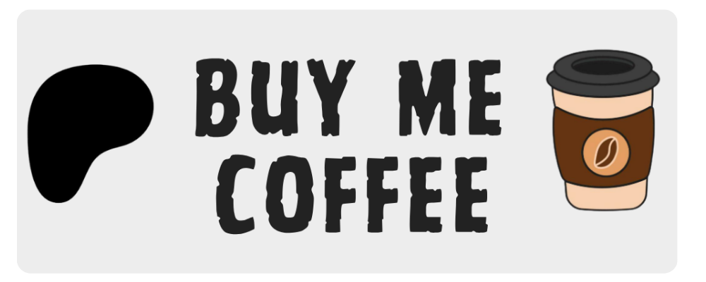
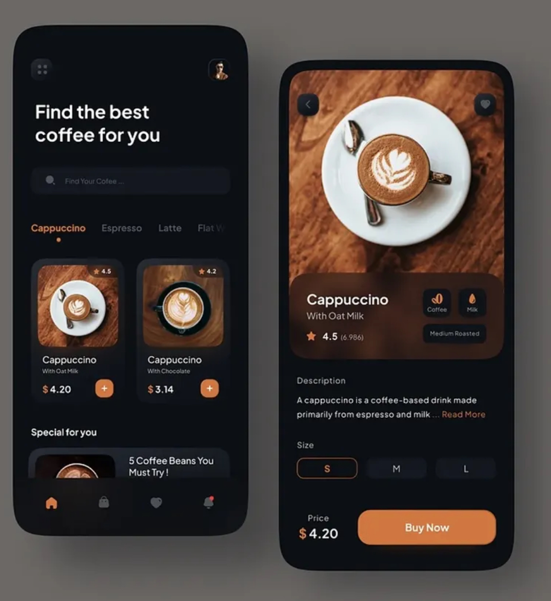
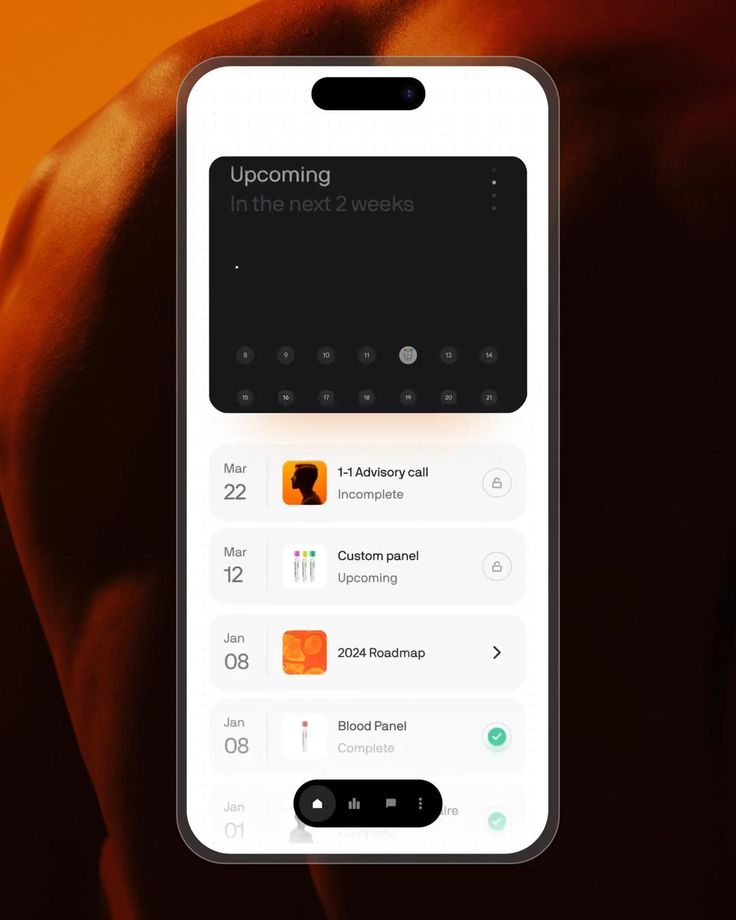
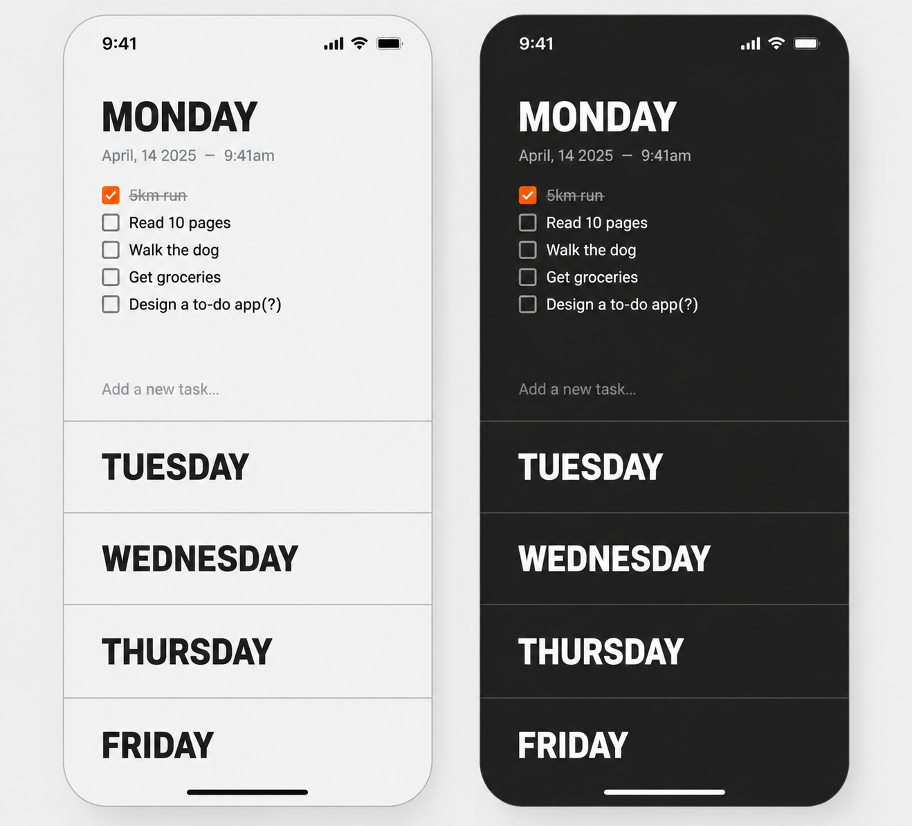
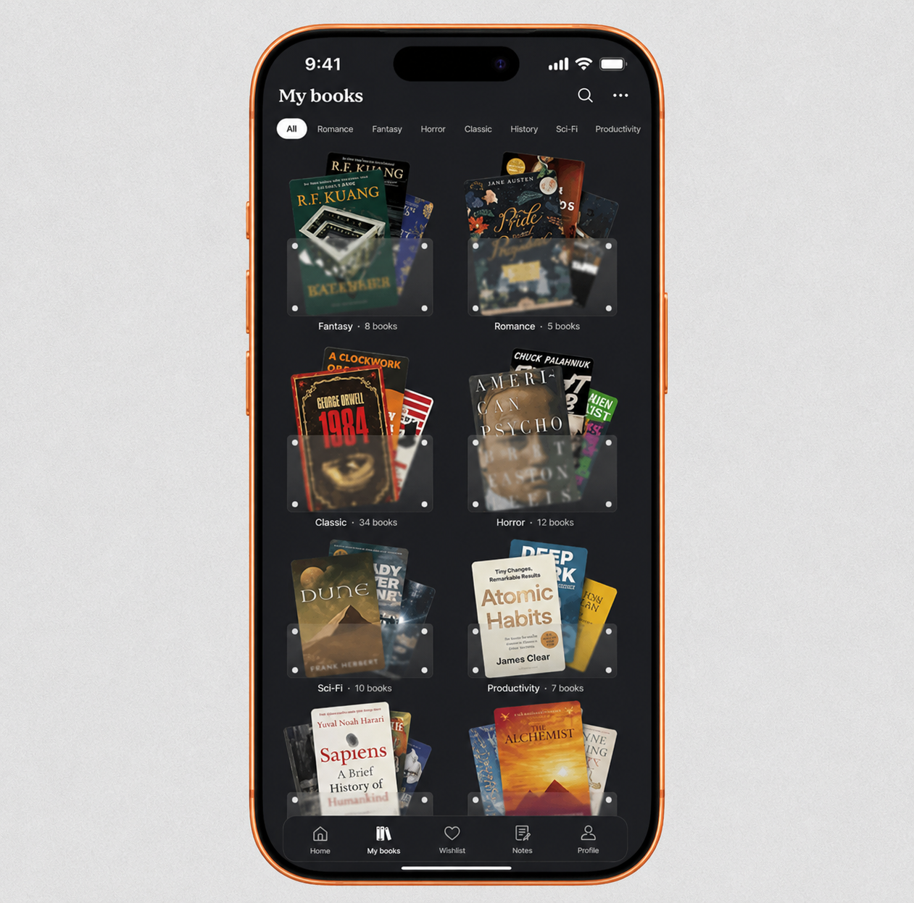

# Best Flutter UI Templates

A collection of beautiful, production-ready Flutter UI templates and animations built with Flutter and Dart.

<p align="left">
  <a href="https://www.patreon.com/c/junaidjameel/membership">
    
  </a>
</p>

Completely free and open source. New UI templates are added regularly.

---

## Featured UIs

### 1. [Dark Explore UI](https://github.com/junaidjamel/Best-Flutter-UI-Templates/tree/main/lib/features/three_d_object)

A minimal dark Explore screen featuring object cards, category filters, and a modern mobile UI layout.

#### UI Reference


---

### 2. [Coffee Shop UI](https://github.com/junaidjamel/Best-Flutter-UI-Templates/tree/main/lib/features/coffee_shope)

A modern coffee shop mobile UI featuring product filters, coffee cards, a detail screen, size selection, and a checkout CTA.

#### UI Reference



---

### 3. [Event Animation UI](https://github.com/junaidjamel/Best-Flutter-UI-Templates/tree/main/lib/features/event_animation)

A clean event planner UI featuring animated summary cards, schedule items, image tiles, and a floating bottom navigation.

#### UI Reference



---

### 4. [Minimal Todo UI](https://github.com/junaidjamel/Best-Flutter-UI-Templates/tree/main/lib/features/todo)

A minimal functional todo app with light and dark theme.

#### UI Reference



---

### 5. [Book Shelf UI](https://github.com/junaidjamel/Best-Flutter-UI-Templates/tree/main/lib/features/book_shelf)

A modern bookshelf UI featuring category filters, searchable shelves, liquid-glass book stacks, and interactive shelf details.

#### UI Reference



---

## Upcoming UIs

More Flutter UI templates will be added soon, including:

- Onboarding screens
- Authentication screens
- E-commerce UI
- Dashboard UI
- Profile screens
- Animated Flutter interfaces

---

## Run Project

```bash
flutter pub get
flutter run
```

Star the repo if you like it.
